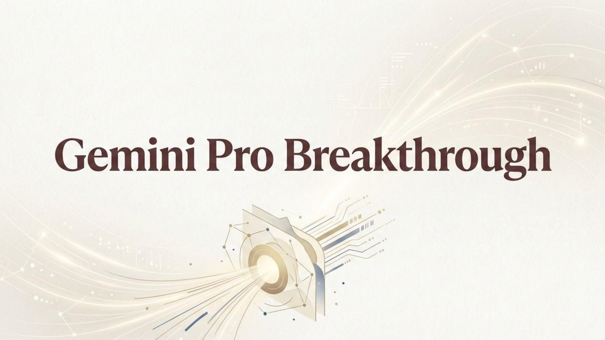

# Google Gemini Pro Breakthrough – Digdata Challenge

[](https://www.r-project.org/)
[](https://posit.co/)
[](https://drive.google.com/file/d/15M5duYxRUiRNoEg-80dA8Yi66bWlmDHN/view)

Data analytics pipeline and strategy presentation developed for Google's Gemini Pro student marketing campaign (Digdata Step Up Challenge), optimising the allocation of a **£10M marketing budget** using statistical hypothesis testing and multi-channel performance metrics.

---

## Presentation Deck

<p align="center">
  <a href="docs/Gemini_Pro_Breakthrough_Presentation.pdf">
    
  </a>
  <br />
  <em>Click the image or link to view: <b><a href="docs/Gemini_Pro_Breakthrough_Presentation.pdf">Gemini_Pro_Breakthrough_Presentation.pdf</a></b></em>
</p>

---

## Key Findings & Results

* **Search Channel Dominance**: Drove **505,336 conversions** at a **£4.25 Cost Per Conversion (CPC)**—making it 10x more cost-efficient than Display (**£42.31 CPC**).
* **High-ROI Markets**: South Africa (**SA**) and Egypt (**EG**) accounted for **71.4% of total conversions** (~£5.00 CPC), while the UK and Germany (**DE**) were 3x more costly.
* **Statistical Filtering**: Executed two-proportion $Z$-tests ($\alpha = 0.05$) on exposed vs. control groups; identified that 100% of statistically insignificant lifts stemmed from Display campaigns in the UK/DE.
* **Cost Per Lifted User (CPLU)**: New Year '24 was the most cost-effective campaign; Back to School campaigns were the least efficient (up to **£0.30 CPLU**).
* **Creative Lift**: The *"Life Hack"* creative led in consideration, while *"Grade Booster"* achieved the highest purchase intent in Egypt (**3.44 absolute lift**).

---

## Strategy Recommendations

* **Budget Reallocation**: Allocate **65%** of each market's budget to Search; restrict Display to **<10%**.
* **Market Focus**: Concentrate **>80%** of total spend in SA and EG, scaling the New Year campaign model.
* **Creative Deployment**: Prioritise *"Grade Booster"* in Egypt and *"Life Hack"* across all other markets.
* **Campaign Timeline**: Deploy across all markets in Weeks 1–2; reallocate remaining spend towards channels driving maximum consideration lift from Week 3 onwards.

---

## Methodology

### Phase 1: Statistical Hypothesis Testing (`BrandLiftsSignificance.R`)
Filters survey noise via a **two-proportion $Z$-test** ($\alpha = 0.05$) to isolate genuine consideration lift:

* **Pooled Proportion ($\hat{p}$)**:

  $$\hat{p} = \frac{X_{\text{control}} + X_{\text{exposed}}}{N_{\text{control}} + N_{\text{exposed}}}$$

* **Standard Error ($\text{SE}$)**:

  $$\text{SE} = \sqrt{\hat{p}(1 - \hat{p}) \left(\frac{1}{N_{\text{control}}} + \frac{1}{N_{\text{exposed}}}\right)}$$

* **$Z$-Score & Two-Tailed $p$-Value**:

  $$Z = \frac{p_{\text{exposed}} - p_{\text{control}}}{\text{SE}}, \quad p = 2 \times (1 - \Phi(\vert{}Z\vert{}))$$

* **Significance Filter ($p < 0.05$)**: Discards non-significant cohorts ($p \ge 0.05$). All dropped cohorts were Display campaigns in UK/DE.

### Phase 2: Relational Data Integration (`BrandLifts&CampaignsMerge.R`)
Inner joins significant lifts with historical performance metrics on composite keys: `Campaign_Name`, `Market`, and `Channel`.

### Phase 3: Unit Economics
Derives **Cost Per Lifted User (CPLU)** across all validated campaigns:

* **Absolute Lift**: 

  $$\text{Absolute Lift} = p_{\text{exposed}} - p_{\text{control}}$$

* **Lift Volume**: 

  $$\text{Lift Volume} = \text{Absolute Lift} \times \text{Reach}$$

* **Cost Per Lifted User (CPLU)**:

  $$\text{CPLU} = \frac{\text{Spend}_{\text{GBP}}}{\text{Lift Volume}}$$

---

## Repository Structure

```text
├── README.md
├── docs/
│   ├── Gemini_Pro_Breakthrough_Presentation.pdf   # Full presentation slide deck (PDF)
│   └── slides/slide_1.png                         # Presentation cover image
├── Data/
│   ├── Raw Data/                                  # Source datasets (excluded for copyright)
│   └── Processed Data/                            # Generated outputs (excluded for copyright)
└── Scripts/
    ├── Repo.Rproj                                 # RStudio project configuration
    ├── BrandLiftsSignificance.R                   # Hypothesis testing script
    └── BrandLifts&CampaignsMerge.R                # Data integration & CPLU calculation
```

## Certification

* **Credential**: [Digdata & Google Certification](https://drive.google.com/file/d/15M5duYxRUiRNoEg-80dA8Yi66bWlmDHN/view)
